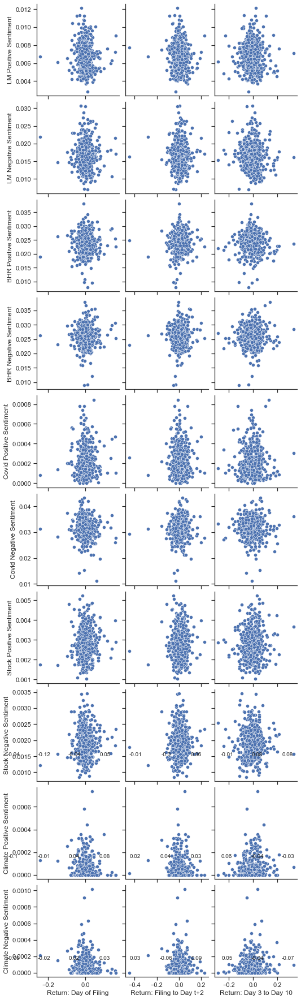

# Brandon Smeltz: Fin 377 Midterm Project - S&P500 10-k Sentiment Analysis

## Project Summary

In this project, my objective is to examine the relationship between the tone and sentiment expressed in S&P500 companies' 10-k filings and their subsequent stock returns. To achieve this, I used the provided stock return data and devised measures to determine stock performance following the release of these 10-k filings. I created two distinct measures: the first measure calculated the "buy and hold" return from the filing date until two days after, while the second measure focused on the period from three days after until ten days after the filing date. Additionally, I generated ten sentiment scores, evaluating each 10-k document based on both positive and negative tones using general and topic-specific words. Using these sentiment scores I can then correlate how the 10-k is discussing certain topics and correlate that sentiment with the returns I calculated.

My findings, while unexpected, align reasonably well with Table 3 of the Garcia, Hu, and Rohrer paper. Contrary to my expectations, I did not observe significant positive correlations from the positive sentiment variables or the negative sentiment variables, but rather had very conflicting results between the two datasets. However, I did identify meaningful correlations from the selected topic variables, which I subsequently used to explore potential Covid & stock implications. Overall, this project offers valuable insights into the sentiment expressed in 10-k documents and its association with subsequent stock returns.

## Data

### The Sample

For this project I used two main data sources. I used a list of S&P500 firms to gather relevant information from the 10-k data. I also used the CRSP .zip file for information regarding the daily stock returns from 2022 for the S&P500 firms.

### The Dataset


```python
import numpy as np
import pandas as pd

Analysis_Sample = pd.read_csv('output/analysis_sample.csv')

# Showing Returns & Sentiment scores
Analysis_Sample.iloc[:, :17]
```


<div>
<style scoped>
    .dataframe tbody tr th:only-of-type {
        vertical-align: middle;
    }

    .dataframe tbody tr th {
        vertical-align: top;
    }

    .dataframe thead th {
        text-align: right;
    }
</style>
<table border="1" class="dataframe">
  <thead>
    <tr style="text-align: right;">
      <th></th>
      <th>Ticker</th>
      <th>Accession Number</th>
      <th>Document Length</th>
      <th>Number of Unique Words</th>
      <th>BHR Positive Sentiment</th>
      <th>BHR Negative Sentiment</th>
      <th>LM Positive Sentiment</th>
      <th>LM Negative Sentiment</th>
      <th>Return: Day of Filing</th>
      <th>Return: Filing to Day t+2</th>
      <th>Return: Day 3 to Day 10</th>
      <th>Covid Positive Sentiment</th>
      <th>Covid Negative Sentiment</th>
      <th>Stock Positive Sentiment</th>
      <th>Stock Negative Sentiment</th>
      <th>Climate Positive Sentiment</th>
      <th>Climate Negative Sentiment</th>
    </tr>
  </thead>
  <tbody>
    <tr>
      <th>0</th>
      <td>MMM</td>
      <td>0000066740-22-000010</td>
      <td>76433</td>
      <td>6384</td>
      <td>0.025683</td>
      <td>0.031662</td>
      <td>0.006659</td>
      <td>0.023956</td>
      <td>0.007573</td>
      <td>-0.017671</td>
      <td>-0.090256</td>
      <td>0.000407</td>
      <td>0.029139</td>
      <td>0.003228</td>
      <td>0.002021</td>
      <td>0.000000</td>
      <td>0.000015</td>
    </tr>
    <tr>
      <th>1</th>
      <td>AOS</td>
      <td>0000091142-22-000028</td>
      <td>33811</td>
      <td>3801</td>
      <td>0.024459</td>
      <td>0.023602</td>
      <td>0.005738</td>
      <td>0.013339</td>
      <td>-0.012737</td>
      <td>0.003184</td>
      <td>-0.053547</td>
      <td>0.000122</td>
      <td>0.030745</td>
      <td>0.002330</td>
      <td>0.001895</td>
      <td>0.000000</td>
      <td>0.000000</td>
    </tr>
    <tr>
      <th>2</th>
      <td>ABT</td>
      <td>0001104659-22-025141</td>
      <td>52062</td>
      <td>5045</td>
      <td>0.021590</td>
      <td>0.024394</td>
      <td>0.005493</td>
      <td>0.012965</td>
      <td>-0.031431</td>
      <td>-0.027617</td>
      <td>0.013731</td>
      <td>0.000157</td>
      <td>0.028742</td>
      <td>0.004348</td>
      <td>0.003043</td>
      <td>0.000013</td>
      <td>0.000078</td>
    </tr>
    <tr>
      <th>3</th>
      <td>ABBV</td>
      <td>0001551152-22-000007</td>
      <td>61561</td>
      <td>5886</td>
      <td>0.019753</td>
      <td>0.022644</td>
      <td>0.008577</td>
      <td>0.015887</td>
      <td>-0.006484</td>
      <td>0.012347</td>
      <td>0.018329</td>
      <td>0.000145</td>
      <td>0.032768</td>
      <td>0.002706</td>
      <td>0.002578</td>
      <td>0.000097</td>
      <td>0.000097</td>
    </tr>
    <tr>
      <th>4</th>
      <td>ACN</td>
      <td>0001467373-22-000295</td>
      <td>51955</td>
      <td>5169</td>
      <td>0.027967</td>
      <td>0.023963</td>
      <td>0.011260</td>
      <td>0.017207</td>
      <td>-0.007076</td>
      <td>0.003446</td>
      <td>0.107431</td>
      <td>0.000038</td>
      <td>0.030791</td>
      <td>0.001982</td>
      <td>0.001289</td>
      <td>0.000038</td>
      <td>0.000077</td>
    </tr>
    <tr>
      <th>...</th>
      <td>...</td>
      <td>...</td>
      <td>...</td>
      <td>...</td>
      <td>...</td>
      <td>...</td>
      <td>...</td>
      <td>...</td>
      <td>...</td>
      <td>...</td>
      <td>...</td>
      <td>...</td>
      <td>...</td>
      <td>...</td>
      <td>...</td>
      <td>...</td>
      <td>...</td>
    </tr>
    <tr>
      <th>493</th>
      <td>YUM</td>
      <td>0001041061-22-000009</td>
      <td>64013</td>
      <td>5134</td>
      <td>0.026854</td>
      <td>0.027307</td>
      <td>0.007374</td>
      <td>0.016512</td>
      <td>-0.019989</td>
      <td>-0.002821</td>
      <td>-0.062237</td>
      <td>0.000301</td>
      <td>0.037144</td>
      <td>0.002146</td>
      <td>0.001635</td>
      <td>0.000052</td>
      <td>0.000079</td>
    </tr>
    <tr>
      <th>494</th>
      <td>ZBRA</td>
      <td>0000877212-22-000026</td>
      <td>46979</td>
      <td>4750</td>
      <td>0.028396</td>
      <td>0.026842</td>
      <td>0.007514</td>
      <td>0.015475</td>
      <td>-0.077843</td>
      <td>-0.157306</td>
      <td>-0.019582</td>
      <td>0.000220</td>
      <td>0.032507</td>
      <td>0.003933</td>
      <td>0.002886</td>
      <td>0.000308</td>
      <td>0.000297</td>
    </tr>
    <tr>
      <th>495</th>
      <td>ZBH</td>
      <td>0001564590-22-007160</td>
      <td>64915</td>
      <td>4577</td>
      <td>0.021505</td>
      <td>0.026758</td>
      <td>0.006408</td>
      <td>0.022167</td>
      <td>0.026077</td>
      <td>0.026020</td>
      <td>-0.042855</td>
      <td>0.000291</td>
      <td>0.029477</td>
      <td>0.003184</td>
      <td>0.002140</td>
      <td>0.000051</td>
      <td>0.000017</td>
    </tr>
    <tr>
      <th>496</th>
      <td>ZION</td>
      <td>0000109380-22-000072</td>
      <td>70173</td>
      <td>6453</td>
      <td>0.019965</td>
      <td>0.023898</td>
      <td>0.005159</td>
      <td>0.015305</td>
      <td>0.060027</td>
      <td>-0.030312</td>
      <td>-0.011241</td>
      <td>0.000080</td>
      <td>0.011110</td>
      <td>0.003117</td>
      <td>0.001359</td>
      <td>0.000000</td>
      <td>0.000000</td>
    </tr>
    <tr>
      <th>497</th>
      <td>ZTS</td>
      <td>0001555280-22-000078</td>
      <td>78431</td>
      <td>5913</td>
      <td>0.021790</td>
      <td>0.033507</td>
      <td>0.007523</td>
      <td>0.020336</td>
      <td>0.006771</td>
      <td>-0.017105</td>
      <td>0.015538</td>
      <td>0.000034</td>
      <td>0.028941</td>
      <td>0.001026</td>
      <td>0.001161</td>
      <td>0.000277</td>
      <td>0.000317</td>
    </tr>
  </tbody>
</table>
<p>498 rows × 17 columns</p>
</div>


### Return Variables

To create my return variables, I utilized the `.rolling` function to calculate the returns within a rolling window from time `t` to `t+3` for the first variable and from time `t+3` to `t+10` for the second variable. To actually calculate these returns, I applied the formula:

\[ (1 + R_1) * (1 + R_2) ... - 1 \]

In code form this equation looks like:

```python
.apply(lambda x: np.prod(1+x)-1)
```

For the second variable, which evaluates returns from `t+3` to `t+10`, I also used an `.iloc` argument to adjust the calculation to begin at `t+3` rather than `t`. The code to obtain this return variable is:

```python
.apply(lambda x: np.prod(1+x.iloc[3:])-1)
```

Furthermore, I utilized `.groupby` to organize the calculation by ticker, ensuring returns were computed specific to each firm. Additionally, I employed `.shift` in my code to realign all of the returns upwards, which allowed them to correspond with the filing date for much simpler merging. To finalize the process, I used `.reset_index` to reset the index. In order to calculate both of these return variables I used the code that I have provided below:

```python
ret_2022['ret_3'] = ret_2022.groupby('ticker')['ret'].rolling(3).apply(lambda x: np.prod(1+x)-1).shift(-2).reset_index(0, drop=True)

ret_2022['ret_10'] = ret_2022.groupby('ticker')['ret'].rolling(11).apply(lambda x: np.prod(1+x.iloc[3:])-1).shift(-10).reset_index(0, drop=True)
```

### Sentiment Variables

#### LM & BHR:

Given that the lists were already predefined, my task before computing their sentiment score was to ensure they were formatted appropriately to use with the NEAR_regex function. This function requires the list of words to be searched in a particular format, with words separated by a vertical bar(pipe) and enclosed within parentheses and apostrophes. For instance, the format should resemble '(happy|smile|good)' as we learned in class. Consequently, I utilized the following code to transform the LM and BHR lists into the correct format with the BHR Positive code shown below:

```python
BHR_positive =(pd.read_csv('inputs/ML_positive_unigram.txt',header=None))[0].tolist()
BHR_rgx_positive = "({})".format('|'.join(BHR_positive))
```


#### Topic Variables:

To establish the topic variables, my first step involved crafting a list of words associated with the topic, suitably formatted to use with NEAR_regex. These lists typically were composed of roughly five to eleven words each. Subsequently, once I had these lists of words for each topic, I constructed a variable comprising both my topic words and the BHR positive/negative words, forming a list to be fed into the NEAR_regex function. My code for my positive covid sentiment variable is shown below:

```python
covid_words = '(covid|covid19|coronavirus|plague|virus|pandemic|sickness|disease)'
covid_positive = [covid_words, '('+"|".join(BHR_positive)+')']
covid_rgx_positive = NEAR_regex(covid_positive,max_words_between=5)
```

#### Sentiment Scores:

Once the LM, BHR, and Topic variables were established, I proceeded to iterate over all of the 10-k filings to compute the ten sentiment scores, one for each variable for each filing. In order to accomplish this, I implemented a for loop that accessed each 10k as an HTML file, performed cleaning operations with beautiful soup, and then calculated individual sentiment scores. The calculation of each score involved utilizing the `len()` function and NEAR_regex to tally all matching words, which were then divided by the total number of words in the 10-k document which I called doc length. Additionally, I opted for setting `max_words_between=5` when scanning for instances of sentiment, as I deemed it to be the maximum allowable distance between the words I sought to match while still ensuring their relevance and proximity. Finally, I appended all of these scores into a list before adding them to the dataframe. My sample code for calculating the Covid Positive Sentiment score is shown below:

```python
Covid_positive_length = len(re.findall(NEAR_regex(covid_positive,partial = False, max_words_between=5), clean_doc))
Covid_positive_sentiment = Covid_positive_length / doc_length
```

#### Datapoints about Sentiment Variables

As part of this project I was also tasked with finding the number of words in each of the provided dicionaries for the LM and BHR positive and negative values. My results for the length of this dictionary is listed below:

BHR Positive: 75 \
BHR Negative: 94 \
LM Positive: 354 \
LM Negative: 2355

Additonally I chose to use

```python
partial = True
```
because I wanted to account for all variations of base words for example in the stock set I wanted investor to search for investor, investors, etc...

Lastly, like I mentioned above, I believe the `max_words_between=5` should be 5 because I believe this value is the best to account for filler or spacing words between the two you are interested in connecting while also not being too far apart that the words can be taken out of context.

### Topic Variables

#### Topic 1: Covid

Even still in 2022, the lingering impact of COVID continues to affect firms across various industries. While the pandemic's intensity and restrictions have settled down in 2022, my objective is to explore the continuing influence on S&P500 companies and their stock returns as their are still many issues present in the economy due to Covid.

#### Topic 2: Stock

Due to Covid and all of the economic issues that followed it such as supply chain issues, the lockdown, transportation, the shift to remote working, etc... the stock market has been very volatile over the past couple of years before 2022. I know that the point of this dataset is to observe the returns at various times and see how the stock is doing; however I wanted more information and to test if my hypoothesis regarding positive sentiment would correlate to positive returns and vise-versa or if there would just be an overall negative or overall positive tone associated with stock due to the craziness that has happened over the last several years.

#### Topic 3: Climate Change

With everything going on in the world in 2022, there have been many changes to the world such as remote working and an increased desirability in sustainability and the overall good for the climate. As a result, I wanted to observe how companies were discussing their sustainability initiatives and what actions in pursuit of climate change may have on their stock. For example, would companies who take an interest in making a positive impact correlate with higher stock returns due to an increased demand stemming from consumers liking the company and their goals better.

### Final Analysis Summary Stats


```python
Analysis_Sample.iloc[:, :17].describe()
```


<div>
<style scoped>
    .dataframe tbody tr th:only-of-type {
        vertical-align: middle;
    }

    .dataframe tbody tr th {
        vertical-align: top;
    }

    .dataframe thead th {
        text-align: right;
    }
</style>
<table border="1" class="dataframe">
  <thead>
    <tr style="text-align: right;">
      <th></th>
      <th>Document Length</th>
      <th>Number of Unique Words</th>
      <th>BHR Positive Sentiment</th>
      <th>BHR Negative Sentiment</th>
      <th>LM Positive Sentiment</th>
      <th>LM Negative Sentiment</th>
      <th>Return: Day of Filing</th>
      <th>Return: Filing to Day t+2</th>
      <th>Return: Day 3 to Day 10</th>
      <th>Covid Positive Sentiment</th>
      <th>Covid Negative Sentiment</th>
      <th>Stock Positive Sentiment</th>
      <th>Stock Negative Sentiment</th>
      <th>Climate Positive Sentiment</th>
      <th>Climate Negative Sentiment</th>
    </tr>
  </thead>
  <tbody>
    <tr>
      <th>count</th>
      <td>498.000000</td>
      <td>498.000000</td>
      <td>498.000000</td>
      <td>498.000000</td>
      <td>498.000000</td>
      <td>498.000000</td>
      <td>489.000000</td>
      <td>489.000000</td>
      <td>485.000000</td>
      <td>498.000000</td>
      <td>498.000000</td>
      <td>498.000000</td>
      <td>498.000000</td>
      <td>498.000000</td>
      <td>498.000000</td>
    </tr>
    <tr>
      <th>mean</th>
      <td>70731.777108</td>
      <td>5482.761044</td>
      <td>0.023941</td>
      <td>0.025898</td>
      <td>0.006780</td>
      <td>0.016432</td>
      <td>0.000741</td>
      <td>0.003362</td>
      <td>-0.008294</td>
      <td>0.000214</td>
      <td>0.031700</td>
      <td>0.002737</td>
      <td>0.001903</td>
      <td>0.000057</td>
      <td>0.000077</td>
    </tr>
    <tr>
      <th>std</th>
      <td>29366.745125</td>
      <td>1117.416479</td>
      <td>0.003491</td>
      <td>0.003401</td>
      <td>0.001463</td>
      <td>0.003682</td>
      <td>0.034288</td>
      <td>0.052250</td>
      <td>0.064712</td>
      <td>0.000141</td>
      <td>0.003734</td>
      <td>0.000747</td>
      <td>0.000442</td>
      <td>0.000084</td>
      <td>0.000110</td>
    </tr>
    <tr>
      <th>min</th>
      <td>9786.000000</td>
      <td>1521.000000</td>
      <td>0.007965</td>
      <td>0.008952</td>
      <td>0.002858</td>
      <td>0.007072</td>
      <td>-0.242779</td>
      <td>-0.447499</td>
      <td>-0.288483</td>
      <td>0.000000</td>
      <td>0.011110</td>
      <td>0.001026</td>
      <td>0.000857</td>
      <td>0.000000</td>
      <td>0.000000</td>
    </tr>
    <tr>
      <th>25%</th>
      <td>52074.500000</td>
      <td>4805.000000</td>
      <td>0.021919</td>
      <td>0.023964</td>
      <td>0.005685</td>
      <td>0.014001</td>
      <td>-0.016493</td>
      <td>-0.025470</td>
      <td>-0.048074</td>
      <td>0.000116</td>
      <td>0.029633</td>
      <td>0.002238</td>
      <td>0.001594</td>
      <td>0.000000</td>
      <td>0.000002</td>
    </tr>
    <tr>
      <th>50%</th>
      <td>65953.000000</td>
      <td>5352.000000</td>
      <td>0.024122</td>
      <td>0.025900</td>
      <td>0.006761</td>
      <td>0.016203</td>
      <td>-0.001638</td>
      <td>0.000101</td>
      <td>-0.009661</td>
      <td>0.000176</td>
      <td>0.031867</td>
      <td>0.002620</td>
      <td>0.001872</td>
      <td>0.000030</td>
      <td>0.000040</td>
    </tr>
    <tr>
      <th>75%</th>
      <td>80898.500000</td>
      <td>5919.000000</td>
      <td>0.026110</td>
      <td>0.027822</td>
      <td>0.007697</td>
      <td>0.018361</td>
      <td>0.015826</td>
      <td>0.028495</td>
      <td>0.029294</td>
      <td>0.000291</td>
      <td>0.033920</td>
      <td>0.003182</td>
      <td>0.002154</td>
      <td>0.000073</td>
      <td>0.000104</td>
    </tr>
    <tr>
      <th>max</th>
      <td>271719.000000</td>
      <td>10468.000000</td>
      <td>0.037981</td>
      <td>0.038029</td>
      <td>0.012125</td>
      <td>0.030649</td>
      <td>0.162141</td>
      <td>0.229167</td>
      <td>0.332299</td>
      <td>0.000845</td>
      <td>0.043371</td>
      <td>0.005242</td>
      <td>0.003455</td>
      <td>0.000735</td>
      <td>0.001013</td>
    </tr>
  </tbody>
</table>
</div>


### Smell Tests

Based on all of the different ways I have viewed my dataset, nothing seems to be too fishy. All of the variables have slight variation, but this is expected due to differences in industries and valuing different things. The LM and BHR sentiment scores are overall higher than the topic sentiment scores which I also expected. This is because these variables are simply looking for the key words rather than the keywords in proximity to a  topic. The Covid negative score was the highest of the topic sentiment scores as expected as Covid was an easy scapegoat for a lot of the problems occurring in industry. Stocks also had a generally positive sentiment which I expected, but something that's a little fishy is that when you correlate the positive stock sentiment to the returns they originally start off positive and then flip negative which could be worth further investigation. Also it was a little strange that the climate and sustainability variable had such a low sentiment and was pretty even between the two sides. As far as industries go I was a little surprised that the companies in the pharmaceutical industry were so negative about Covid as I would have thought this to be a very profitable time for them.

### Caveats

Throughout my analysis I noticed several caveats that led to a couple issues. For example, when the S&P 500 data is first imported there is 503 rows of data which I thought was super strange for only 500 firms. It turns out that there were 3 firms with duplicate securities that have the same CIK and upon further analysis there are actually 2 firms without a 10-k at all so once I filtered through these caveats I was left with only 498 rows of information which I believe to be the correct set to use.

## Results

### Correlation Table


```python
columns = ['Return: Day of Filing','Return: Filing to Day t+2', 'Return: Day 3 to Day 10', 'LM Positive Sentiment', 'LM Negative Sentiment', 'BHR Positive Sentiment', 'BHR Negative Sentiment', 'Covid Positive Sentiment', 'Covid Negative Sentiment', 'Stock Positive Sentiment', 'Stock Negative Sentiment', 'Climate Positive Sentiment', 'Climate Negative Sentiment']

correlations = Analysis_Sample[columns].corr()

Analysis_Sample_corr = correlations[['Return: Day of Filing', 'Return: Filing to Day t+2', 'Return: Day 3 to Day 10']].drop(['Return: Day of Filing', 'Return: Filing to Day t+2', 'Return: Day 3 to Day 10'], axis=0)

Analysis_Sample_corr
```


<div>
<style scoped>
    .dataframe tbody tr th:only-of-type {
        vertical-align: middle;
    }

    .dataframe tbody tr th {
        vertical-align: top;
    }

    .dataframe thead th {
        text-align: right;
    }
</style>
<table border="1" class="dataframe">
  <thead>
    <tr style="text-align: right;">
      <th></th>
      <th>Return: Day of Filing</th>
      <th>Return: Filing to Day t+2</th>
      <th>Return: Day 3 to Day 10</th>
    </tr>
  </thead>
  <tbody>
    <tr>
      <th>LM Positive Sentiment</th>
      <td>-0.086713</td>
      <td>-0.097161</td>
      <td>-0.040298</td>
    </tr>
    <tr>
      <th>LM Negative Sentiment</th>
      <td>-0.024558</td>
      <td>-0.014622</td>
      <td>-0.117976</td>
    </tr>
    <tr>
      <th>BHR Positive Sentiment</th>
      <td>0.017433</td>
      <td>0.041823</td>
      <td>-0.039977</td>
    </tr>
    <tr>
      <th>BHR Negative Sentiment</th>
      <td>0.034926</td>
      <td>0.083724</td>
      <td>0.051119</td>
    </tr>
    <tr>
      <th>Covid Positive Sentiment</th>
      <td>0.026387</td>
      <td>0.015696</td>
      <td>-0.011474</td>
    </tr>
    <tr>
      <th>Covid Negative Sentiment</th>
      <td>-0.063212</td>
      <td>0.037122</td>
      <td>-0.001846</td>
    </tr>
    <tr>
      <th>Stock Positive Sentiment</th>
      <td>0.086980</td>
      <td>0.027152</td>
      <td>0.057039</td>
    </tr>
    <tr>
      <th>Stock Negative Sentiment</th>
      <td>0.053516</td>
      <td>0.057319</td>
      <td>-0.008465</td>
    </tr>
    <tr>
      <th>Climate Positive Sentiment</th>
      <td>-0.039612</td>
      <td>-0.043408</td>
      <td>0.083311</td>
    </tr>
    <tr>
      <th>Climate Negative Sentiment</th>
      <td>-0.065107</td>
      <td>-0.028762</td>
      <td>0.082642</td>
    </tr>
  </tbody>
</table>
</div>


### Scatterplot


```python
import seaborn as sns
import matplotlib.pyplot as plt 

sns.set(style="ticks")
plot = sns.pairplot(Analysis_Sample, x_vars=['Return: Day of Filing','Return: Filing to Day t+2', 'Return: Day 3 to Day 10'], y_vars=['LM Positive Sentiment', 'LM Negative Sentiment', 'BHR Positive Sentiment', 'BHR Negative Sentiment', 'Covid Positive Sentiment', 'Covid Negative Sentiment', 'Stock Positive Sentiment', 'Stock Negative Sentiment', 'Climate Positive Sentiment', 'Climate Negative Sentiment'], kind='scatter', diag_kind='hist')

# Filter out non-numeric columns
numeric_columns = Analysis_Sample.select_dtypes(include='number').columns
corr = Analysis_Sample[numeric_columns].corr()

# Add numerical correlations
corr = corr.loc[['Return: Day of Filing','Return: Filing to Day t+2', 'Return: Day 3 to Day 10'], ['LM Positive Sentiment', 'LM Negative Sentiment', 'BHR Positive Sentiment', 'BHR Negative Sentiment', 'Covid Positive Sentiment', 'Covid Negative Sentiment', 'Stock Positive Sentiment', 'Stock Negative Sentiment', 'Climate Positive Sentiment', 'Climate Negative Sentiment']]
corr = corr.round(2)
labels = [str(x) for x in corr.values.flatten()]
for i, label in enumerate(labels):
    plot.fig.text((i % 10 + 0.5) * 0.1, (i // 10 + 0.5) * 0.1, label, ha='center', va='center')

plt.show(plot)

for i, label in enumerate(labels):
    row = i // 3
    col = i % 3
    plot.fig.text((col + 0.5) * 30, (row + 0.5) * 30, label, ha='center', va='center')

```


    

    


## Discussion Topics

### 1. LM Sentiment vs. BHR Sentiment

Overall, BHR has a stronger correlation than LM does. This surprised me as the LM set for positive and negative words was much larger than the BHR set. However, I suppose this stronger correlation for BHR can be attributed to better words that are simply found more often throughout the 10-k's. Additionally, the sentiments are both positively correlated for the BHR data, but are negative for the LM data. Although both correlations are close to 0 these results are very conflicting as I'm not sure if these lists are proportional or inverses to the returns. Since the BHR data has a slightly greater magnitude for the correlation value I am going to lean towards the sentiment variables and stock returns to have a relevant correlation that I can use to somewhat predict returns.

### 2. Comparison to Table 3 of the Garcia, Hu, and Rohrer paper

My analysis of the LM and BHR sentiment scores in relation to returns exhibits some similarities and some differences with the findings presented in the Garcia, Hu, and Rohrer paper. Consistent with their results, I observe a fairly negative correlation for LM positive sentiment, as well as a positive and higher correlation for ML(BHR) positive sentiment. Likewise, their LM negative sentiment correlation is negative and pretty small like mine. On the contrary, the primary discrepancy is found when comparing the ML(BHR) negative correlation. In contrast to their negative correlation, mine is positive and a pretty strong magnitude.

Possible explanations for these differences could involve the inclusion of more firms in their analysis. The paper included more firms with the goal of obtaining a larger overall sample size. In order to do this they incorporated smaller companies beyond the S&P500. While a larger sample size is generally just regarded as "better", the inclusion of non-S&P500 companies might offer a broader perspective on the relationship between sentiment and stock returns beyond just the inclusion of more samples. Considering that the S&P500 comprises predominantly large-cap American companies, incorporating small-cap companies could provide additional insights into this correlation for how these smaller companies were affected during this interesting time.

### 3.Topic Sentiment Correlations

I believe that the correlations between my topic sentiments and returns is significant enough to be investigated further. They are all roughly as equally strong or stronger in magnitude than the provided correlations with the LM and BHR datasets. Something interesting I noticed is that the return data generally decreases in magnitude as you get further away from the filing date indicating that there may be above average swings in returns when these 10-k's are filed.

Specific data that I found interesting is the covid negative sentiment and the stock positive as these have the highest correlations of -0.063212 and 0.086980 respectively which is higher in magnitude than all of the correlations for the provided BHR and LM sets. If these measures are accurate it would mean that the companies who talked negatively about Covid will likely have a decline in their stock after the release of their 10-k. Similarly companies who took positively about their stock may also be creating a future increase in their returns. Both of these situations could cause opportunities to make money if they hold true whether than be by buying companies optimistic about their stock or shortening companies who complain about covid.

### 4. Short and Long Term Return Analysis

For the BHR positive correlation, the correlations with the returns are initially positive with a decent magnitude, indicating that when a company talks well about their stock that it will likely do very well in the short run as investors are optimistic and willing to buy that companies stock. However, in the long run the BHR positive correlation is negative indicating that the returns will fall. This could be because the company talked themselves up in the 10-k, but in reality aren't doing that great which investors eventually figure out.

For the BHR negative correlation, all of the values are positive and have a relatively increasing magnitude over time. This indicates that when a company talks negatively in their 10-k it will have a negative impact on their returns as well as investors want to avoid a potentially bad situation/ poor performance from the company.
